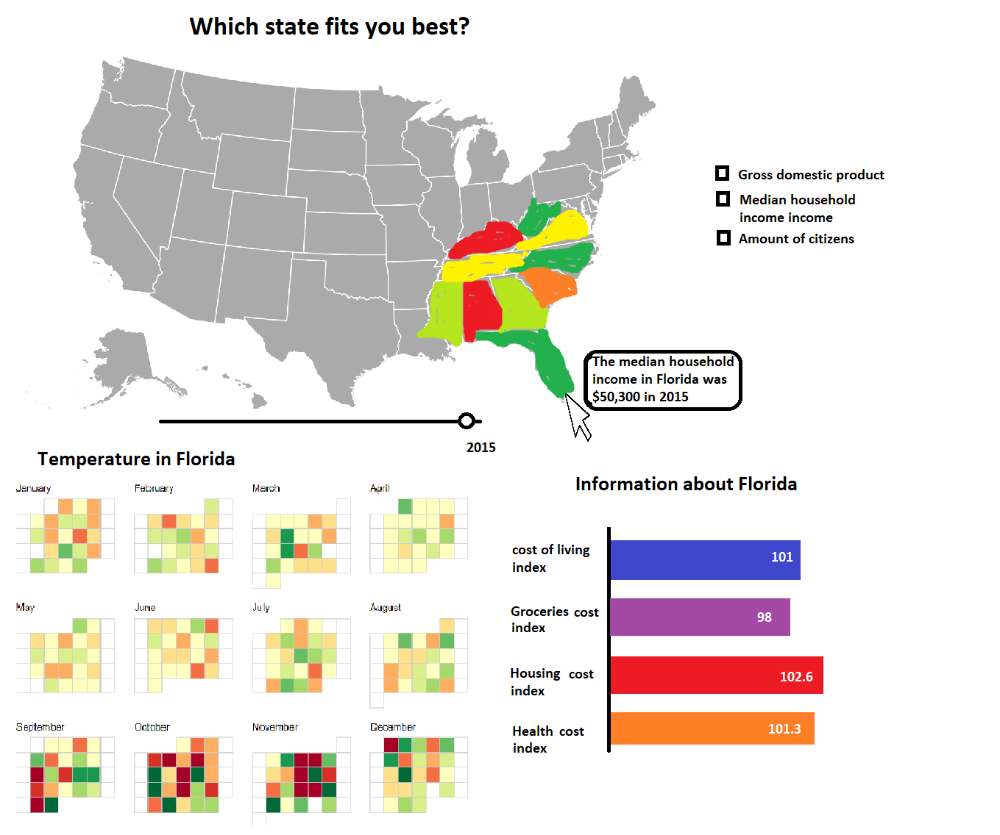

# Proposal

## Data sources:
* The cost of living, groceries, housing and health index
https://www.missourieconomy.org/indicators/cost_of_living/

* Median income 2011-2015
https://en.wikipedia.org/wiki/List_of_U.S._states_by_income

* Gross domestic product 2011-2015
https://www.bea.gov/iTable/iTable.cfm?reqid=70&step=10&isuri=1&7003=200&7035=-1&7004=sic&7005=1&7006=xx&7036=-1&7001=1200&7002=1&7090=70&7007=-1&7093=levels#reqid=70&step=10&isuri=1&7003=200&7004=naics&7035=-1&7005=1&7006=xx&7001=1200&7036=-1&7002=1&7090=70&7007=-1&7093=levels

* Amount of citizens 2011-2015
https://www.census.gov/data/tables/2016/demo/popest/state-total.html

* Weather: https://www.ncdc.noaa.gov/cdo-web/webservices/v2#datasets
Or https://www.usclimatedata.com/ 

## External components:
I think all this can be done with basic d3 and if necessary some help from d3-tip.

## Similar visualizations:
* Weather calendar: http://bl.ocks.org/KathyZ/c2d4694c953419e0509b
* USA map:  https://bl.ocks.org/mbostock/2206590 

## Difficulties:
The calendar is going to be the most difficult, because I have to test how the data loads and how I can make it in to the calendar. If the calendar give a lot of problems I will look for other datasets. If the visualization goes well I want to enable an option to compare states on the bottom right.

## Requirements
* Story: A lot of people migrate these days, what if you want to move to the states? This tool will help you choose which state fits you best.
* 3 linked interactions: the two bottom visualizations change according to your choice of state. The weather of the choose state will be shown on the bottom left and some indices about costs of living will show in the bottom right. 
* 2 interactive components: you can chose want you want to see (GDP, income and population) and you can slide a time bar from 2011 up till 2015.
