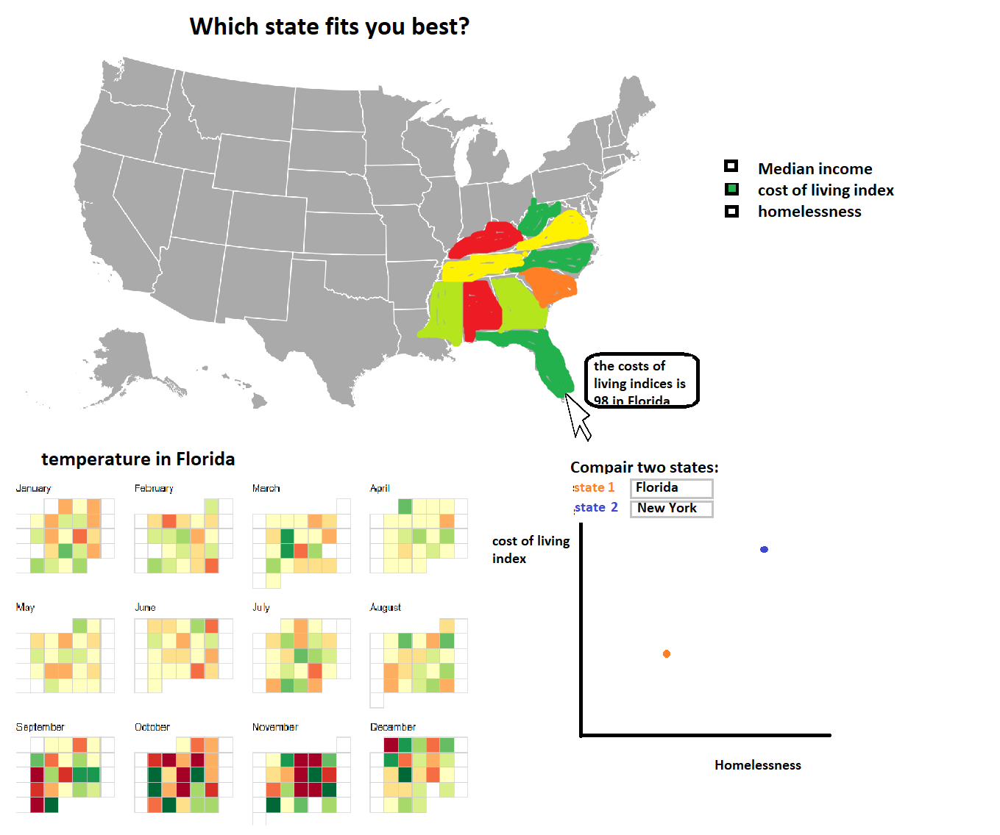

# Project

## Data sources:
* The cost of living index
https://www.missourieconomy.org/indicators/cost_of_living/

* Median income
http://time.com/money/5177566/average-income-every-state-real-value/

* Homelessness
https://www.usich.gov/tools-for-action/map/#fn[]=1500&fn[]=2900&fn[]=6100&fn[]=10100&fn[]=14100
per citizen: https://en.wikipedia.org/wiki/List_of_U.S._states_and_territories_by_population

* Weather: https://www.ncdc.noaa.gov/cdo-web/webservices/v2#datasets
Or https://www.usclimatedata.com/ 

## External components:
I think all this can be done with basic d3 and if necessary some help from d3-tip.

## Similar visualizations:
* Weather calander: http://bl.ocks.org/KathyZ/c2d4694c953419e0509b
* Usa map:  https://bl.ocks.org/mbostock/2206590 
* Scatterplot: my week 6 project  https://github.com/11014067/homework/tree/master/Homework/week_6

## Dificulties:
The calander is going to be hard because I have to test how the data loads and how I can make it in to the calander. If a calander really seams to be unmakeable I can make it a simple line or bar chart with average temperature each month and a dataset that only shows monthly averages.
