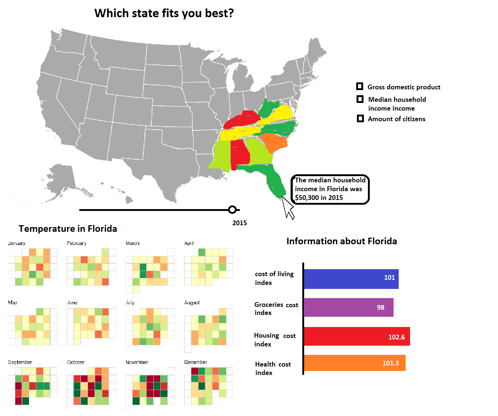

# Project

## Data sources:
* The cost of living, goceries, housing and health index
https://www.missourieconomy.org/indicators/cost_of_living/

* Median income
http://time.com/money/5177566/average-income-every-state-real-value/

* Weather: https://www.ncdc.noaa.gov/cdo-web/webservices/v2#datasets
Or https://www.usclimatedata.com/ 

## External components:
I think all this can be done with basic d3 and if necessary some help from d3-tip.

## Similar visualizations:
* Weather calander: http://bl.ocks.org/KathyZ/c2d4694c953419e0509b
* Usa map:  https://bl.ocks.org/mbostock/2206590 
* Scatterplot: my week 6 project  https://github.com/11014067/homework/tree/master/Homework/week_6

## Dificulties:
The calander is going to be hard because I have to test how the data loads and how I can make it in to the calander. If a calander really seams to be unmakeable I can make it a simple line or bar chart with average temperature each month and a dataset that only shows monthly averages.

## Requirements
* Story: you want to move to the states, which state is best. Which has the least homelessness and the best payout?
* 3 linked interactions: the two bottem visualisations change according to your choice if you click a country the weather will be shown on the bottem left and it will be state 1 on the bottem right to compair it to another state. As well as according to what you see on the map (income, cost of living and homelessness) it compaires that on the bottem right for two states.
* 2 interactive components: you can chose want you want to see (income, cost of living and homelessness) and you can chose which two states you want to compair.
